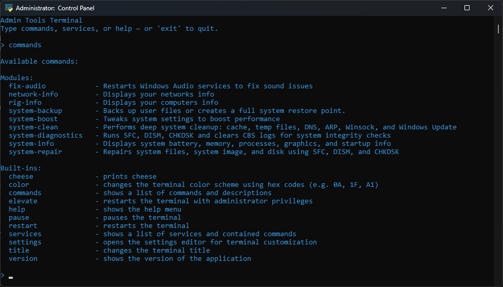

# **Admin Tools – Modular, Script‑Driven Utilities for Windows**


Easily modifiable admin tools covering everything from system, rig, and network information to diagnostics and repair.

---

## **Original Version**
- **Version 1 has been moved to https://github.com/Adrian-Surkovic/Admin-Tools-Original/tree/main** 


## **Usage & Licensing**
You may use, modify, and distribute this program for any purpose, **as long as you credit the original author**.

---

## **Requirements**
- **System:** Windows 10 or Windows 11  
- **Path Variables:** `ipconfig`, `sfc`, `chkdsk`  
- **Privileges:** Administrator rights required for most commands

---

## **Disclaimer**
I am not responsible for any misuse of this program in illegal or unethical contexts.

---

## **Important Notes**
The **system-boost** command disables certain Windows Defender scheduled tasks to improve performance.  
This may reduce system protection.  
Use at your own risk — and seriously, don’t download malware.

The **system-backup** command will not backup folders saved to Onedrive. This is a known non-issue as it means the things you are trying to backup are already saved. 

## **Developer Note**
The automatic update system is fully implemented, but I’m unable to test it myself because I always run the latest development version. The update mechanism only triggers when a user’s local version is behind the version published on GitHub. This means real‑world testing can only be done by users who are running an older version. If you encounter any issues with the updater, please report them so I can address them quickly.

---

## **Version 3.0.0 (Python Edition)**

Modding support will follow the same philosophy as the original version:  
**simple, modular, drop‑in commands with minimal setup.**

Version 3.0.0 will also (eventually) introduce the ability to wrap around PowerShell 7 and hook directly into the commands.

## **File Structure**
```
Admin Tools 3.0.0/
│
├── json/             # Contains settings json file and version file.
├── modules/          # Drop‑in commands (system, network, rig, etc.)
├── services/         # Core services (update, rollback, elevation)
├── src/              # Embedded runtimes (fallback)
│   ├── powershell7/  # Planned
│   └── python-3.14.2-embed-amd64/
│
├── main.py           # Main entry point
├── start.pyw         # GUI/shortcut launcher
├── TODO.md           # Development notes
└── README.md
```
## **Basic Usage**
To run the program, double click the **start.pyw** bootstrapper, if you do not have python installed you may use the python that comes bundled in the src folder. 
The program was tested and coded on Python 3.14.2, however other version may work. 
To enter admin mode, run the **elevate** command. 
To modify or add modules, simply drop in or edit files py in the **/modules** folder. 
To modify or add services, simply drop in or edit py files in the **/services** folder.

## **Changing Settings**
To change settings, you must first run the **settings** command. This will enter a settings prompt where you can change settings. Type **options** for a list of settings.

## **Custom Module / Service Template**
```py
imports
def function(shell):
    cmd_name=""
    cmd_description=""
```
# Notes: #
1. **Modules** are user facing commands whereas **Services** can directly affect the way the terminal works.
2. Multiple functions can be defined, only functions with **cmd_name** and **cmd_description** will be loaded.
3. if you put ```function()``` at the end of your module or service it will auto run.  
